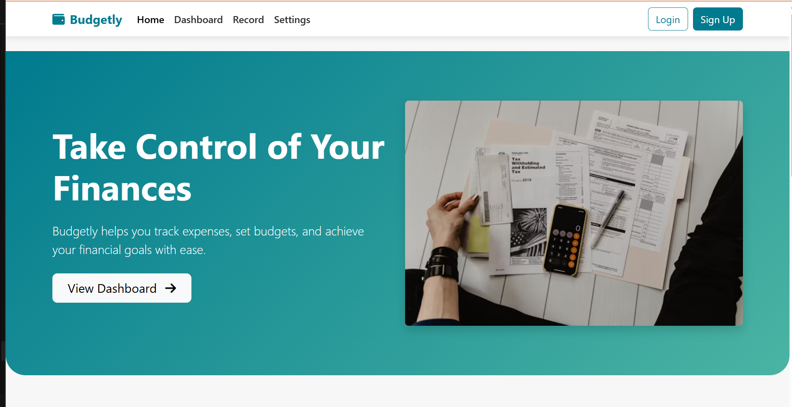
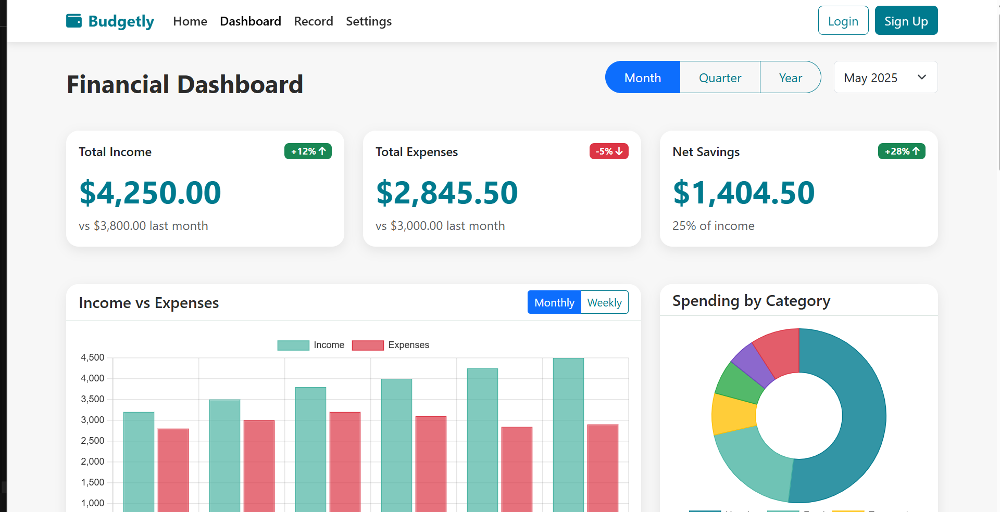

# Budget-Tracker-Website
Budgetly is a responsive budget tracker built with HTML, CSS, JavaScript, Bootstrap, and Chart.js. It features a modern dashboard with income, expenses, and savings summaries, interactive charts, budget progress tracking, insights, and recent transactions to help users manage finances effectively.

## 🚀 Features

Responsive UI for desktop & mobile

Dashboard with income, expenses & savings summary

Interactive charts (Income vs Expenses, Category-wise spending)

Budget progress tracking with progress bars

Financial insights & recommendations

Recent transactions section

Organized pages: Home | Dashboard | Record | Settings

## 📸 Preview

## 🛠️ Tech Stack

Frontend: HTML, CSS, Bootstrap 5

JavaScript: Dynamic interactivity

Charts: Chart.js
